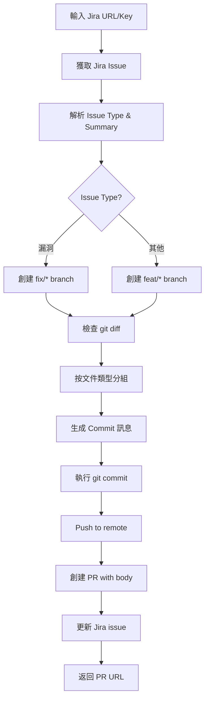
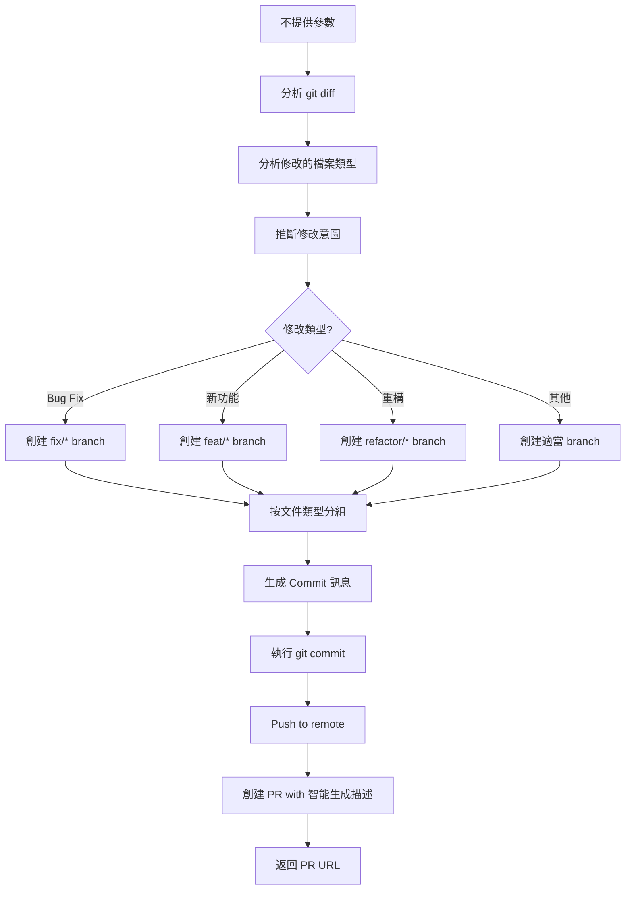

# 快速開始：使用 /jira-pr Skill

## 一鍵智能創建 PR

這個 skill 支援兩種模式：
- **Jira 模式**：從 Jira issue 獲取資訊
- **智能分析模式**：自動分析程式碼修改

### 基本用法

#### 方式 1：Jira 模式（有 Jira Issue）

1. **完成你的代碼修改**
   ```bash
   # 修改你的文件...
   # 不需要 git add 或 git commit
   ```

2. **執行 skill**
   ```bash
   /jira-pr EK-907
   ```

   或使用完整 URL：
   ```bash
   /jira-pr https://showyouapp.atlassian.net/browse/EK-907
   ```

3. **等待自動完成**
   - ✅ 獲取 Jira issue 資訊
   - ✅ 自動從 dev 創建 branch
   - ✅ 自動分組提交修改
   - ✅ 自動 push 到 remote
   - ✅ 自動創建 PR
   - ✅ 自動更新 Jira issue
   - ✅ 返回 PR 連結

#### 方式 2：智能分析模式（無 Jira Issue）

1. **完成你的代碼修改**
   ```bash
   # 修改你的文件...
   # 不需要 git add 或 git commit
   ```

2. **執行 skill（不提供參數）**
   ```bash
   /jira-pr
   ```

3. **等待自動完成**
   - ✅ 智能分析程式碼修改
   - ✅ 自動生成 PR 標題和描述
   - ✅ 自動從 dev 創建 branch
   - ✅ 自動分組提交修改
   - ✅ 自動 push 到 remote
   - ✅ 自動創建 PR
   - ✅ 返回 PR 連結

### 完整示例

#### 示例 1：Jira 模式

假設你修復了 EK-907 的問題：

```bash
# 1. 你修改了這些文件
# - app/src/main/AndroidManifest.xml
# - app/src/main/java/.../MainActivity.kt
# - app/src/main/java/.../SplashActivity.kt

# 2. 執行 skill
/jira-pr EK-907

# 3. Skill 自動執行：
# ✅ 獲取 Jira issue: [Android] 當點擊進入貼文資訊頁下，縮小APP再次返回後，會莫名被退回前一頁問題
# ✅ 創建 branch: fix/EK-907-fix-post-detail-activity-stack-on-resume
# ✅ Commit 1: [EK-907] 修改 MainActivity launchMode 為 singleTop 以避免清除上層 Activity
# ✅ Commit 2: [EK-907] 優化 SplashActivity 重啟邏輯，從 Launcher 啟動時保留 Activity Stack
# ✅ Push to origin
# ✅ 創建 PR: https://github.com/SHOW-YOU-APP/ekkorn-android/pull/110
# ✅ 更新 Jira issue 狀態和添加評論

# 4. 完成！
```

#### 示例 2：智能分析模式

假設你優化了登入流程，但沒有對應的 Jira issue：

```bash
# 1. 你修改了這些文件
# - app/src/main/java/.../LoginViewModel.kt
# - analytics/src/main/java/.../AFTracker.kt
# - app/src/main/java/.../NewcomerBonusBanner.kt

# 2. 執行 skill（不提供參數）
/jira-pr

# 3. Skill 自動執行：
# ✅ 分析程式碼修改：LoginViewModel、AFTracker、NewcomerBonusBanner
# ✅ 智能生成摘要：「優化登入流程的新手引導橫幅顯示邏輯並加強事件追蹤」
# ✅ 判斷修改類型：Feature (feat)
# ✅ 創建 branch: feat/improve-login-newcomer-banner-and-tracking
# ✅ Commit 1: feat: 優化 LoginViewModel 新手引導橫幅的顯示條件
# ✅ Commit 2: feat: 新增 AFTracker 登入流程事件追蹤
# ✅ Commit 3: feat: 改善 NewcomerBonusBanner UI 顯示效果
# ✅ Push to origin
# ✅ 創建 PR 包含智能生成的完整描述

# 4. 完成！即使沒有 Jira issue 也能創建結構完整的 PR
```

### 進階用法

#### 不提供 Jira 參數（智能分析模式）

```bash
/jira-pr
```

不提供參數時，skill 會自動啟用**智能分析模式**，分析你的程式碼修改來生成 PR。

#### 自定義 Commit 訊息

如果你想要自定義 commit 訊息，可以在執行 skill 前先 stage 部分文件：

```bash
# Stage 你想要單獨 commit 的文件
git add app/src/main/AndroidManifest.xml

# 執行 skill
/jira-pr EK-907

# Skill 會：
# 1. 先 commit 已 staged 的文件
# 2. 然後自動分組剩餘的修改
```

### Skill 執行的流程

#### Jira 模式流程



#### 智能分析模式流程



### Branch 命名規則

#### Jira 模式

| Issue Type | Branch 前綴 | 示例 |
|-----------|------------|------|
| 漏洞 (Bug) | `fix/` | `fix/EK-907-fix-activity-stack` |
| 功能 (Story) | `feat/` | `feat/EK-908-add-dark-mode` |
| 任務 (Task) | `feat/` | `feat/EK-909-refactor-code` |

#### 智能分析模式

| 偵測到的修改類型 | Branch 前綴 | 示例 |
|----------------|-----------|------|
| Bug Fix | `fix/` | `fix/resolve-login-crash` |
| 新功能 | `feat/` | `feat/add-dark-mode-support` |
| 重構 | `refactor/` | `refactor/network-layer` |
| 效能優化 | `perf/` | `perf/optimize-image-loading` |

### Commit 訊息規則

#### Jira 模式

所有 commit 都會自動加上 issue key 前綴：

```
[EK-907] {描述修改內容}
```

#### 智能分析模式

使用 Conventional Commits 格式：

```
{type}: {描述修改內容}
```

示例：
- `fix: 修正登入頁面閃退問題`
- `feat: 新增深色模式支持`
- `refactor: 重構網路層架構`

#### 智能分組邏輯

Skill 會根據修改的文件智能分組：
- AndroidManifest 修改 → 單獨一個 commit
- Activity/Fragment 修改 → 按類別分組
- ViewModel 修改 → 單獨分組
- 其他修改 → 按邏輯分組

### PR Body 自動生成

#### Jira 模式

PR 會自動包含：

```markdown
## 問題描述
{從 Jira description 提取}

## 解決方案
{從代碼修改總結}

## 測試場景
- [ ] {自動生成的測試項目}

## 相關 Issue
- Jira: [EK-907](https://showyouapp.atlassian.net/browse/EK-907)
```

#### 智能分析模式

PR 會自動包含：

```markdown
## 修改描述
{從程式碼修改智能分析出的描述}

影響範圍：
- {分析出的受影響功能/模組}

## 主要變更
{各個 commit 的詳細說明}

## 測試場景
- [ ] {根據修改內容生成的測試項目}
```

### 常見問題

#### Q: 什麼時候該用 Jira 模式，什麼時候該用智能分析模式？
A:
- **有 Jira issue**：使用 Jira 模式（`/jira-pr EK-907`），可以自動更新 Jira issue 狀態
- **沒有 Jira issue** 或**快速修改**：使用智能分析模式（`/jira-pr`），快速創建 PR

#### Q: 我可以修改 PR body 嗎？
A: 可以！PR 創建後可以在 GitHub 上直接編輯。

#### Q: 如果我想要更多的 commit？
A: 你可以在執行 skill 前手動 stage 並 commit 部分文件，skill 會自動處理剩餘的修改。

#### Q: Skill 會修改我的 git 設定嗎？
A: 不會。Skill 只會創建 branch、commit 和 PR，不會修改任何 git 設定。

#### Q: 智能分析模式的 PR 描述準確嗎？
A: Skill 會根據程式碼修改智能生成描述，通常很準確。如果需要，創建後可以在 GitHub 上編輯補充。

#### Q: 如果 Jira issue 不存在會怎樣？
A: 在 Jira 模式下，Skill 會提示錯誤。你可以改用智能分析模式（`/jira-pr`）。

#### Q: 我可以指定其他 base branch 嗎？
A: 目前 base branch 固定為 `dev`。如果需要修改，可以編輯 skill 文件。

#### Q: 智能分析模式會不會猜錯修改類型？
A: Skill 使用程式碼分析來推斷修改類型，通常很準確。如果不滿意可以創建後手動調整 branch 名稱和 PR 標題。

### 疑難排解

#### Skill 找不到

確保 skill 文件在正確位置：
```bash
ls -la .claude/skills/jira-pr.json
```

重啟 Claude Code 後再試。

#### Jira 連接失敗

檢查 MCP server 配置：
```bash
# 在 Claude Code 中應該能看到 Jira MCP server 連接狀態
```

#### GitHub 授權失敗

確認 gh CLI 已登入：
```bash
gh auth status
```

如果未登入：
```bash
gh auth login
```

### 下一步

- 查看 [README.md](./README.md) 了解更多 skills
- 查看 [jira-pr.json](./jira-pr.json) 了解 skill 配置
- 創建你自己的自定義 skill！
